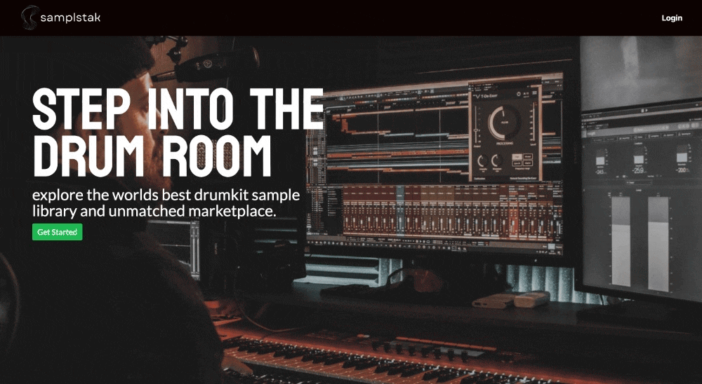
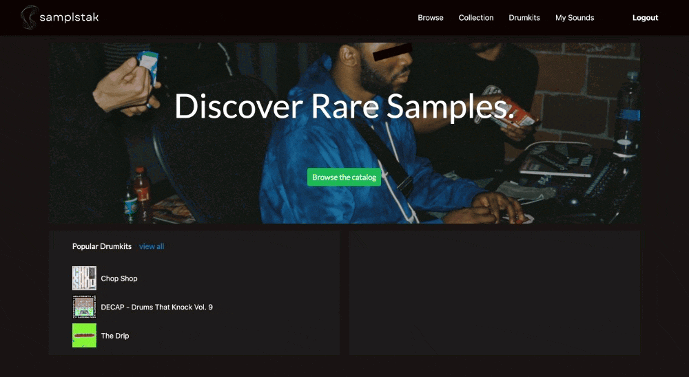
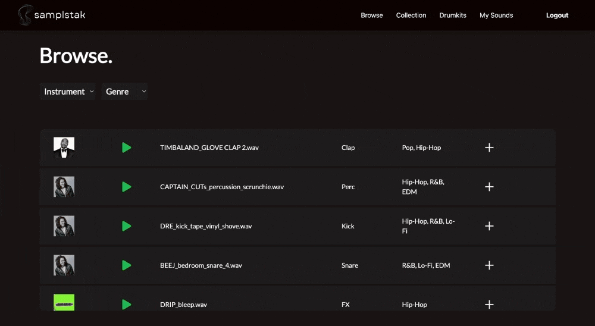
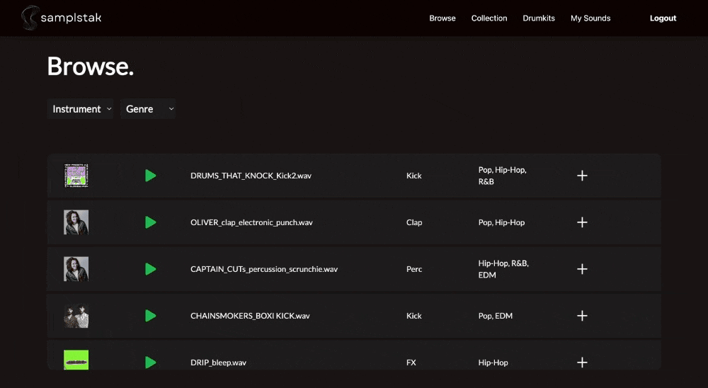
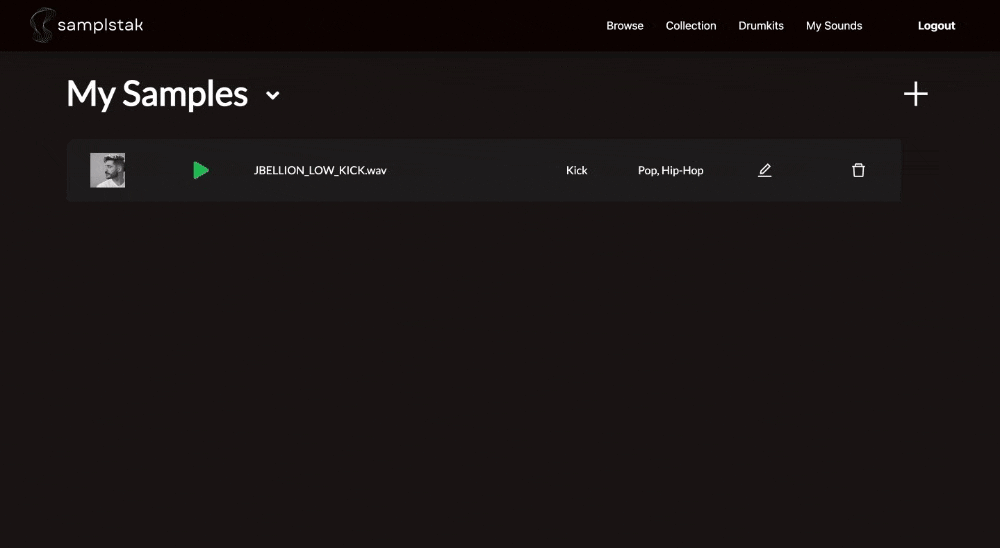

## SamplStak

---


### [Video Demo](https://www.loom.com/share/7ce29a209a524674a989752a16db0d98?sid=c94a1919-87d7-44ca-a290-4ca19fd0cfa9)

<b style="font-size: 20px;"><i>..explore the worlds best drumkit sample
library and unmatched marketplace.</i></b>

### Application Overview

Most modern music productions utilize audio samples to elevate and achieve their sonic goals for their project song. Whether it is a piano melody, or a drum break, or a sound clip of cars passing by on a busy road, producers "chop up" these audio files in their DAWS(digital audio workstations) to isolate specific parts (loops) to inspire the main riff of a song or layer sounds on top of each other for a unique "one-shot" sound. Drum samples specifically, are _very_ unique and are often _made_, _collected_, and _traded_ amongst producers in packs (zip files) called "drumkits."
**SamplStak** is a platform for users to browse samples created by others and to upload their very own samples to share.

## Technologies Used

       

## Running This Application

### Installation

Along with this repository, you will need to clone the [SamplStak Server](https://github.com/nicholasvaldez/samplstak-server) repo, which contains the database and api endpoints.

1. Clone this repository and change to the directory in the terminal.

```sh
git clone git@github.com:nicholasvaldez/samplstak-client.git
cd samplstak-client
```

2. Access the data by following the instructions found here:

<a href="https://github.com/nicholasvaldez/samplstak-server" target="_blank"></a>

3. Launch the client.

```sh
    npm install
    npm start
```

### User Stories

- User able to register for a new account on SamplStak
- An existing user able to login to SamplStak
- User able to listen to audio samples within the app
- Uesr able to filter samples while browsing samples
- User able to add samples to their personal collection
- User able to browse drumkits
- User able to upload their own samples and drumkits
- User able to have a dedictaed view that displays their uploaded samples and drumkits
- User able to edit and delete their uploaded samples and drumkits

### Features

- Samples
  - User able to differentiate the user who uploaded the sample by profile image next to sample play button
  - If the original user who uploaded a sample, also uploaded it to drumkit, the drumkit cover art will display next to the sample play button
- Drumkits
  - When user clicks on a drumkit card, they will be redirected to a drumkit detail view that shows all samples associated with that drumkit
  - User can filter all drumkits by genre
  - All samples within the drumkit, are samples of the drumkits genre
- Users' Uploads

  - User has a list of their uploaded samples at the My Sounds path
  - Plus sign is a button that routes user to add a sample form
  - "My Samples" header is a button that toggles the view to "My Drumkits" that displays the users drumkits
  - The same plus sign toggles the route to add a drumkit form when the view is switched

  ## User Experience

---

#### User Login



---

#### Browse Samples



---

#### Add to Collection



---

#### Browse Drumkits



---

#### Create a Sample


---

#### Create a Drumkit



---

#### Create a Drumkit Sample


#### Demo User Credentials

<p>
Username: <i>Carrie1945</i>
<br>
Password: <i>me</i>

#### Nick Valdez

<a href="https://www.github.com/nicholasvaldez/" target="_blank"></a> <a href="https://www.linkedin.com/in/nicholasvaldez/" target="_blank"></a>
